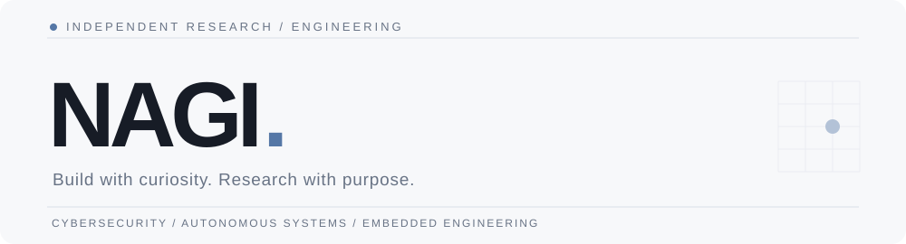

 

Student engineer based in Taiwan. Exploring how systems work, and building what comes next.

[Portfolio](https://nagi.tw) &nbsp;·&nbsp; [Research Notes](https://notes.nagi.tw) &nbsp;·&nbsp; [Projects](https://github.com/seraphforge?tab=repositories)

 

### 01 / About

I'm **Hong Xin-Fu (Nagi)**, a student engineer at Asia Eastern University of Science and Technology.

My interests sit at the intersection of **security, software, hardware, and applied research**. I work on practical experiments, prototypes, and open engineering projects — from connected devices to autonomous systems.

### 02 / Research & Engineering

| Area | Current interests |
| :--- | :--- |
| Cybersecurity & Networks | 5G/6G security · protocols · systems |
| Embedded & IoT | ESP32 · firmware · device communication |
| Autonomous Systems | UAV · flight control · simulation |
| Medical Technology | Medical IoT · device trust |
| Applied AI | Local LLMs · agents · edge AI |

### 03 / Selected Work

<table>
<tr><td width="50%" valign="top">

#### [AEUST Drone ↗](https://github.com/seraphforge/AEUST_drone)
UAV research and engineering. 
Flight systems · Communications · Autonomy

</td><td width="50%" valign="top">

#### [Nagi.tw ↗](https://github.com/seraphforge/nagi.tw)
Personal engineering and research portfolio. 
Web engineering · Technical identity

</td></tr>
<tr><td valign="top">

#### [Research Notes ↗](https://github.com/seraphforge/notes.nagi.tw)
Technical notes, experiments, and documentation. 
Research · Learning · Writing

</td><td valign="top">

#### [Vacant Education Bureau ↗](https://github.com/seraphforge/Vacant-Education-Bureau)
Information collection and analysis systems. 
Data pipelines · Analysis

</td></tr>
</table>

### 04 / Development Activity

  <picture>
    <source srcset="https://github-readme-stats.vercel.app/api?username=seraphforge&amp;show_icons=true&amp;hide_border=true&amp;bg_color=0d1117&amp;title_color=e6edf3&amp;text_color=9ba8b9&amp;icon_color=8cadd9" media="(prefers-color-scheme: dark)" />
    
  </picture>
  <picture>
    <source srcset="https://github-readme-stats.vercel.app/api/top-langs/?username=seraphforge&amp;layout=compact&amp;hide_border=true&amp;bg_color=0d1117&amp;title_color=e6edf3&amp;text_color=9ba8b9" media="(prefers-color-scheme: dark)" />
    
  </picture>

Statistics are provided by a third-party service and may be temporarily unavailable.

---

RESEARCH · ENGINEERING · CONTINUOUS LEARNING

[**nagi.tw**](https://nagi.tw) &nbsp; / &nbsp; [**notes.nagi.tw**](https://notes.nagi.tw)

